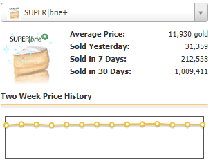

## MouseHunt Marketplace ##

**Overview**

Application goes through all items on MouseHunt Marketplace with an aim to parse current and historical sales prices.

MH Marketplace as of this writing has more than 500 items on stock. Trying to find items that are currently "hot" on the sales can be a daunting task so I set out to find a way to automate this.

Plan is to use WebDriver (Selenium...) automation to mimic a real user. Proof-of-concept (POC) should provide the following:

- login to Mousehunt with credentials (they are hidden in .env file and are not provided publicly)
- click on "Marketplace" button
- click on "Buy" tab
- click dropdown
- select first item (SUPER|brie+)
- parse item information

_POC is currently under development!_

**Installation**

First, do the install. Note: package.json will be cleaned up once development settles.

<code>$ npm install</code>

Configurate webdriverio. It is already configured to my liking, but you can tweak it to your own style. 

<code>$ /node_modules/.bin/wdio config</code>

Rename <code>.env.example</code> to <code>.env</code> and input your own MH credentials.

Run Selenium server standalone (make sure it's in separate terminal window)

<code>$ java -jar selenium-server-standalone-3.9.1.jar</code>

Run the test

<code>$ .\node_modules\.bin\wdio wdio.conf.js
